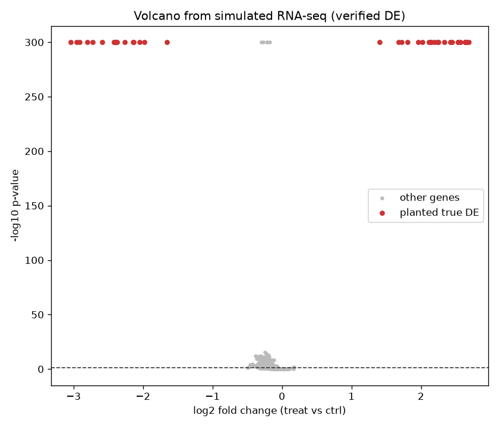

# genai-agent-rnaseq-reproducibility-check

Coding agents will happily write you a 200-line RNA-seq pipeline in thirty seconds. The question is not whether the code runs. The question is whether you can trust the volcano plot it hands back.

This repo is a small harness for treating a coding agent as a collaborator, not an oracle: you let it draft the differential-expression logic, then you run an independent sanity layer that catches the failure modes agents love to introduce silently.

## Demo Output



The plot above was produced from simulated data by `demo.py` — a two-group synthetic count matrix with a handful of planted true positives.

## Why This Exists

GenAI workshops make one thing obvious: the bottleneck stopped being 'can you write the code' and became 'can you verify the code did the right thing'. A coding agent that flips a contrast sign, forgets to filter low counts, or leaks the test labels into normalisation will still produce a plausible-looking figure. Plausible is the dangerous part.

So this scaffold splits the work: an agent-drafted analysis script, plus a fixed, boring, human-owned verification script that never changes and never trusts the agent.

## The Uncomfortable Truth

Most 'AI did my analysis' stories fall apart because nobody re-ran the numbers a second way. If two independent routes to the same fold-changes disagree, one of them is wrong — and you want to find that out before the manuscript, not after review.

## When NOT to Use This

- You have a real dataset and a validated pipeline (DESeq2/edgeR/limma-voom) — use those, this is a teaching scaffold.
- You need rigorous statistics; the demo uses a simple t-test on log-CPM, which is fine for illustration and wrong for tiny replicate counts.
- You want to skip the verification step. Then you do not want this repo; you want a very confident intern.

## Decision Framework

| Situation | Let the agent draft it? | Run the verifier? |
|-----------|-------------------------|-------------------|
| Exploratory prototype | Yes | Yes |
| Production pipeline | Only the scaffolding | Always, plus real tools |
| Teaching / workshop | Yes | Yes, it is the point |
| Regulated submission | No, use validated tools | N/A |

## Quick Start

```
pip install -r requirements.txt
python demo.py
python analyse_rnaseq.py --counts results/demo_counts.csv --groups results/demo_groups.csv
```

`demo.py` generates its own data, runs the whole thing end to end, and drops a figure and a summary table. `analyse_rnaseq.py` is the reusable script you would point at your own count matrix.

## How The Verification Works

The agent-drafted path computes log fold-changes and p-values one way. The verifier recomputes group means directly from raw counts and confirms the direction and rough magnitude of each 'hit'. Disagreements are flagged. It is deliberately dumb, because dumb is auditable.

## A Hard Truth

The agent is faster than you and it does not get tired. It is also confidently wrong in ways you will not notice unless you build the check first. Build the check first.

## Further Reading

Inspired by Ming 'Tommy' Tang, "Using Claude Code for RNA-seq Analysis (Hands-On GenAI Workshop)" (https://divingintogeneticsandgenomics.com/talk/2026-sapa-ne-genai-workshop/).
